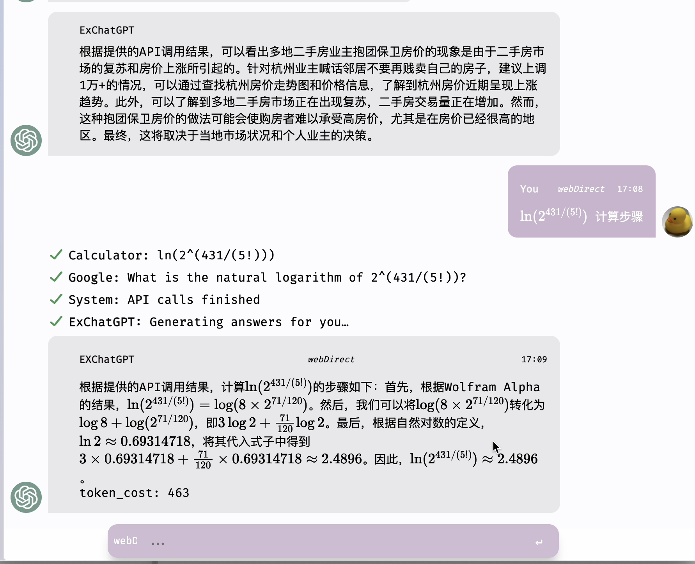

# Ex-ChatGPT - ChatGPT with ToolFormer

   

[简体中文](./README.md) English / [Background](./BACKGROUND.md)

ChatGPT can act as a **tool former** without requiring adjustment, generating API requests for questions to assist in answering. Ex-ChatGPT enables ChatGPT to call external APIs, such as **WolframAlpha, Google, and WikiMedia**, to provide more accurate and timely answers.

This project is divided into `Ex-ChatGPT` and `WebChatGPTEnhance`. The former is a service that uses the `GPT3.5 Turbo API` and **Google,WolframAlpha,WikiMedia APIs**, while the latter is a **browser extension** which update the origin WebChatGPT plugin to Enable adding external API, supportting ChatGPT webpage to call different APIs and prompts

## user interface display

### ExChatGPT

### WebChatGPTEnhance

## Highlights

- **Docker and Proxy support**
- **Redundant backup of chat history**
- Support for OpenAI GPT-3.5 Turbo API
- Ability for ChatGPT to call external API interfaces, such as **Google, WolframAlpha, and WikiMedia**
- Automatic saving and loading of conversation history with **automatic compression**
- Ability to display the number of tokens used
- **OpenAI API key pool**
- **Markdown and MathJax rendering**
- API call process displayed with an animation, similar to Bing
- Conversation management with **load and chat** modes similar to ChatGPT web page layout
- **Shortcut keys** for quickly selecting modes (`Tab`), line breaks (`Shift+Enter`), sending messages (`Enter`), and selecting message history (`up` and `down`), similar to a terminal.
- Automatic **prompt completion** in `Chat Mode` with support for fuzzy search, pinyin search, and custom prompt selection.The project comes with prompt from [awesome-chatgpt-prompts](https://github.com/f/awesome-chatgpt-prompts).

## Installation

### Ex-chatGPT

- `pip install`
`pip install -r requirements.txt`
- Copy `apikey.ini.example` and rename it as `apikey.ini`. Then, fill in your `API key` and `proxy` in `apikey.ini`. If you only have one OpenAI API key, you should delete `key1 = sk-xxxx；key2 = sk-xxxx`.
  - `Google api key and search engine id` [apply](https://developers.google.com/custom-search/v1/overview?hl=en)
  - `wolframAlpha app id key` [apply](https://products.wolframalpha.com/api/)
  - `openAI api key`(new feature) or `chatGPT access_token`(old version) [apply](https://platform.openai.com)
- run the `main.py` and click the local url like `http://127.0.0.1:1234/`
- change the mode in the selection box, now have `chat,detail,web,webDirect,WebKeyWord`

### WebChatGPTEnhanceExtension

- fill you `Googgle api key and client id` in `chatGPTChromeEhance/src/util/apiManager.ts/getDefaultAPI`
- run `npm install`
- run `npm run build-prod`
- get the extension in `chatGPTChromeEhance/build`
- add your `prompts` and `APIs` in option page.
  - `APIs` and `prompts` examples are in `/WebChatGPTAPI`
  - `wolframAlpha` needs to run local sever - `WebChatGPTAPI/WolframLocalServer.py`

## Mode Introduction

### Web Mode

The Web Mode starts by asking ChatGPT a question directly. ChatGPT generates a series of API calls related to the query and uses the first returned result and question to verify and supplement with an API call. Finally, ChatGPT summarizes the information. Web Mode has a better chat ability than just summarizing the response.

### Chat Mode

Chat Mode only calls the OpenAI API interface, similar to the web version of ChatGPT. You can search and choose different prompts by typing `/promtname`, and it supports fuzz search.

### WebDirect Mode

WebDirect Mode first lets ChatGPT generate a series of API calls related to the query. Then, it directly calls a third-party API to search for the answer to each query, and finally, ChatGPT summarizes the information. WebDirect Mode is faster and relatively more accurate for single query information.

### Detail Mode

Detail Mode is an extension of the WebDirect Mode, where an additional API call is made to supplement the current results with further inquiries (such as information not found in the previous search). Finally, ChatGPT summarizes the information.

### Keyword Mode

Keyword Mode generates keywords directly from ChatGPT for querying, using DDG. It doesn't require other API keys. However, its accuracy is relatively poor.

## Update Log

- Redundant backup of chat history.
- Auto-complete prompt selection in chat mode with **fuzzy search** and **Pinyin search** support.

- Update docker and proxy support.

- Shortcut keys for quick mode selection (`Tab`) and line break (`Shift + Enter`), while `Enter` sends the message. Message history selection (`up`, `down`) is similar to a terminal.

- Update chat history management sidebar.

- Update API calls processing animation.

- Web page beautification.

- Update Markdown and MathJax renderer.

- Update chat history token optimizer, and web mode can respond according to chat history. Add token cost counter.

- Update web chat mode selection in the webpage and optimize prompt and token cost. Restrict the token limit.

- Update better support for Chinese queries and add current date info.

- Update web chat mode and fix some bugs.
- Update API configuration.
- Update API pool.
- Automatic saving and loading of conversation history, ChatGPT can retrieve previous conversations.
- Update official support for OpenAI GPT3.5 Turbo API, which is super fast and cheap.
- Update extra API calls and search summarizations to provide a more comprehensive and detailed answer.

  